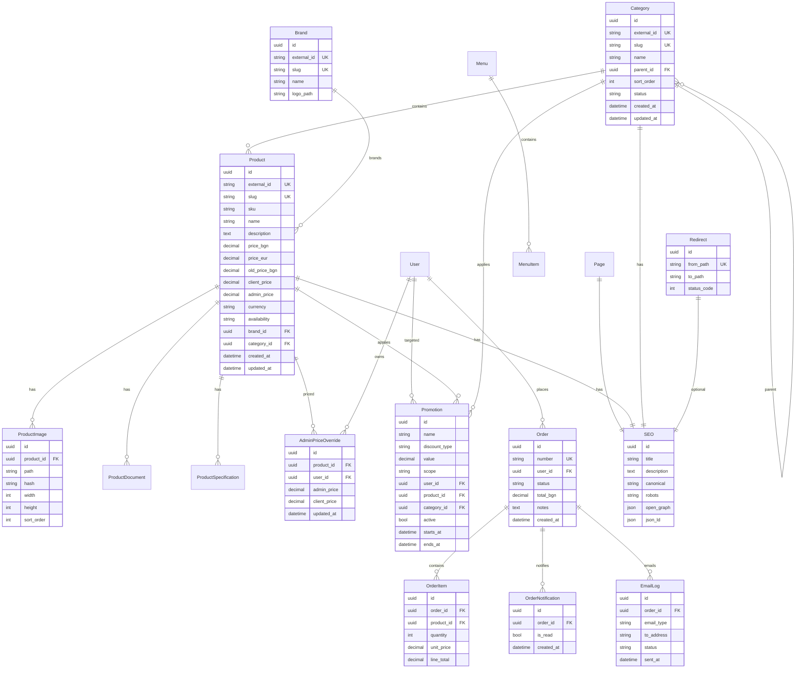

# Database Design

## ER Diagram (logical)

## Django apps & models

| App | Models |
|-----|--------|
| `core` | TimeStampedModel, SoftStatusModel mixins; SiteSettings |
| `categories` | Category |
| `brands` | Brand |
| `products` | Product, ProductImage, ProductDocument, ProductSpecification |
| `seo` | SEO, Redirect |
| `pages` | Page |
| `navigation` | Menu, MenuItem |
| `accounts` | User (custom), Profile |
| `pricing` | AdminPriceOverride |
| `promotions` | Promotion |
| `orders` | Order, OrderItem, OrderNotification, EmailLog |
| `media_app` | MediaAsset (optional shared metadata) |

## Base fields (every entity)

- `id` UUID PK
- `created_at`, `updated_at`
- `slug` (unique where applicable)
- `status` (draft/published/archived)
- `sort_order`
- `external_id` for HTTrack/live sync (unique, indexed)

## Indexes & constraints

- Unique: `(external_id)` on Product, Category, Brand
- Unique: `slug` per entity type
- Index: Product(name), Product(category_id), Order(status), Promotion(scope, active)
- FK ON DELETE: ProductImage CASCADE with Product; OrderItem CASCADE with Order

## Pricing notes (client TBD)

- `Product.client_price` / `Product.admin_price` store defaults
- `AdminPriceOverride` allows per-admin customization later
- Promotion engine: `discount_type` in {`percent`, `flat`}, `scope` in {`user`, `product`, `category`, `global`}

## Image storage

PostgreSQL stores only paths + hash + dimensions. Binaries in `media/`.
